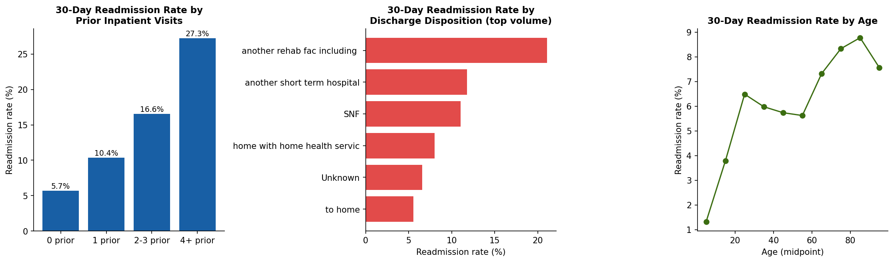
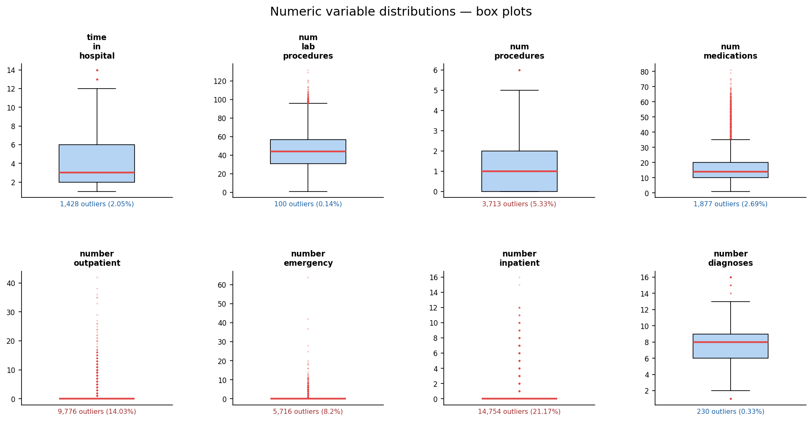

# Predicting 30-Day Hospital Readmission in Diabetic Patients

**Which patient populations and discharge conditions are most predictive of 30-day readmission, and what actionable insights can a care team use to intervene before discharge?**

30-day readmissions cost the U.S. healthcare system billions annually and are a direct quality metric that CMS (Centers for Medicare & Medicaid Services) financially penalizes hospitals for under the Hospital Readmissions Reduction Program. This project cleans, analyzes, and visualizes 10 years of inpatient diabetic encounter data from 130 U.S. hospitals to surface the discharge conditions and patient histories most associated with early readmission — framed as a decision-support question a care coordinator would actually act on, not just a modeling exercise.

## Key findings



- **Prior hospital utilization is the single strongest signal.** Patients with 4+ prior inpatient stays in the past year are readmitted within 30 days at **27.3%**, versus **5.7%** for patients with no prior inpatient stays; a nearly 5x gap. This dwarfs every other variable in the dataset.
- **Discharge destination matters as much as diagnosis.** Patients discharged to another rehab facility are readmitted at **21.1%**; patients discharged to a skilled nursing facility (SNF) at **11.0%**; patients discharged straight home at **5.6%**. Where a patient goes after discharge is one of the most actionable levers a care team controls.
- **Risk rises steadily with age, then plateaus.** Readmission climbs from ~5.6% (ages 45–65) to a peak of **8.8%** in the 80–90 bracket, then dips slightly for the oldest patients (likely a hospice/mortality survivorship effect already filtered out of this dataset).
- **More ER visits and more prior emergencies compound risk.** Patients with 2+ emergency visits in the prior year are readmitted at **13.3%**, nearly double the base rate.
- **Longer stays correlate with modestly higher readmission** (5.1% at 1 day → ~9–10% at 8–10 days), consistent with stay length acting as a proxy for acuity rather than a cause on its own.

**Overall 30-day readmission rate in the cleaned cohort: 7.3%** (5,053 of 69,661 first-encounter patients).

### Actionable takeaways for a care team
1. **Flag patients with 2+ prior inpatient stays for enhanced discharge planning** — this single field carries more signal than any diagnosis code in the dataset.
2. **Treat "discharge to rehab/SNF" as a risk trigger, not just a logistics decision** — these patients readmit at 2–4x the rate of patients discharged home, and warrant a follow-up call or visit within the first week.
3. **Prioritize post-discharge outreach for patients 65+ with any prior ER utilization** — the two factors compound.

## Repository structure

```
├── data/
│   ├── raw/                        # Original UCI extract + ID mapping lookup
│   │   ├── diabetic_data.csv
│   │   └── IDS_mapping.csv
│   └── processed/                  # Output of each cleaning stage (see notebook)
│       ├── diabetic_data_mapped.csv     # after mapping admission/discharge/source IDs to text
│       ├── diabetic_data_cleaned.csv    # after dedup, column drops, null standardization
│       └── Final_Diabetic_Data.csv      # after outlier treatment, ready for Power BI
├── notebooks/
│   └── cleaning.ipynb              # Full cleaning + outlier-analysis pipeline (Python/pandas)
├── reports/
│   ├── outlier_boxplots.png        # IQR outlier diagnostics, all numeric variables
│   └── readmission_key_drivers.png # Key finding charts (regenerated from Final_Diabetic_Data.csv)
├── powerbi/
│   └── readmissionanalysis.pbix    # Interactive Power BI dashboard built on Final_Diabetic_Data.csv
├── docs/
│   └── data_dictionary.md          # Column-by-column definitions + rationale for every drop/transform
└── requirements.txt
```

## Pipeline

The cleaning pipeline in [`notebooks/cleaning.ipynb`](notebooks/cleaning.ipynb) runs in four stages:

1. **ID mapping** — `admission_type_id`, `discharge_disposition_id`, and `admission_source_id` are stored as opaque integers in the raw data. They're mapped to their human-readable text descriptions using `IDS_mapping.csv`, so downstream analysis and the Power BI dashboard are readable without a lookup table.
2. **General cleaning** — drops pure identifiers and near-zero-variance drug columns, deduplicates to one row per patient (first encounter only, to prevent patient-level leakage across a future train/test split), removes columns with catastrophic missingness (>39%), filters out patients discharged to hospice or recorded as expired (not eligible for readmission), and binary-encodes the target (`<30` → 1, everything else → 0).
3. **Null standardization** — collapses inconsistent missing-value representations (`?`, `NaN`, `Not Mapped`, `Not Available`, `Unknown/Invalid`) into a single consistent `Unknown` category per column.
4. **Outlier treatment** — IQR-based outlier diagnostics (see chart below) drive per-column decisions: some variables are left untouched because their range is bounded and clinically meaningful (`time_in_hospital`, `num_lab_procedures`, `number_diagnoses`); others are Winsorized (`num_procedures` capped at 5, `num_medications` capped at the 99th percentile); zero-inflated visit counts (`number_outpatient`, `number_emergency`, `number_inpatient`) are bucketed into ordered categorical bins that preserve the risk gradient without letting rare extreme values distort a future model.

Every decision — what was dropped, why, and what the alternative would have cost — is documented inline in the notebook and in [`docs/data_dictionary.md`](docs/data_dictionary.md).

**Net result:** 101,766 raw encounters → 69,661 clean, de-duplicated, patient-level rows, 50 raw columns → 37 model-ready columns.

### Outlier diagnostics



## Power BI dashboard

`powerbi/readmissionanalysis.pbix` is an interactive dashboard built on `Final_Diabetic_Data.csv` for exploring readmission rate by discharge disposition, age, diagnosis count, prior utilization, and medication regimen — designed for a non-technical audience (care coordinators, hospital administrators) to slice without writing a query. Open it in [Power BI Desktop](https://www.microsoft.com/en-us/power-platform/products/power-bi/desktop) (free) to interact with it.

## Tech stack

- **Python** (pandas, numpy, matplotlib) — data cleaning, null standardization, IQR outlier analysis
- **Jupyter** — cleaning pipeline documentation and reproducibility
- **Power BI** — interactive stakeholder-facing dashboard

## Running it yourself

```bash
git clone <this-repo-url>
cd hospital-readmission-analysis
pip install -r requirements.txt
jupyter notebook notebooks/cleaning.ipynb
```

The notebook expects `data/diabetic_data.csv`, `data/IDS_mapping.csv`, etc. relative to the working directory it's launched from — update the `data/` path in the read_csv calls if you run it from a different location, or launch Jupyter from the repo root and adjust to `../data/...`.

## Data source

[Diabetes 130-US hospitals for years 1999-2008](https://archive.ics.uci.edu/dataset/296/diabetes+130-us+hospitals+for+years+1999-2008), UCI Machine Learning Repository. De-identified, public-domain clinical data covering 130 U.S. hospitals and integrated delivery networks.

## License

MIT — see [LICENSE](LICENSE). The underlying dataset is public domain per the UCI repository's terms.
